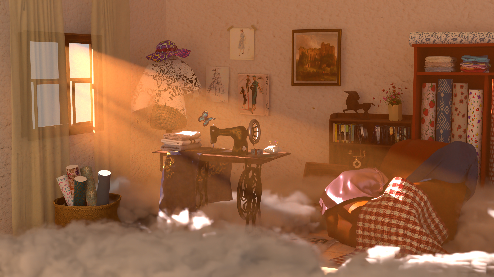

## Overview
Lightfuker is a ray tracer built on the Lightwave framework. This project was developed by me and Tien Nhat Minh Nguyen for the Computer Graphics Winter 2025/26 rendering competition at Saarland University. Check out the project branch for the code.

## Features
Visit https://mzwang34.github.io/Lightfuker/ for more details.
* Integrator
  * Albedo
  * Normal
  * Direct
  * Path Tracing (BSDF, NEE, MIS)
* BSDF
  * Conductor
  * Dielectric
  * Diffuse
  * Principled
  * Rough conductor
  * Rough dielectric
  * Disney
  * Iridescence
  * Lambertian Emission
* Light
  * Area
  * Directional
  * Point
  * Spot
  * Environment map
* Camera
  * Perspective
  * Thinlens
* Texture
  * Constant
  * Checkerboard
  * Image
  * Blackbody
* Volume
  * Homogeneous
  * Heterogeneous
* Sampling
  * Independent
  * Halton
* Shape
  * Sphere
  * Rectangle
  * Mesh
* Acceleration Structure
  * BVH with SAH
* Post Processing
  * Tonemap
  * Bloom
  * Denoising
* Other
  * Alpha masking
  * Normal mapping
  * Custom bokeh shapes

## Credits
Lightwave was written by [Alexander Rath](https://graphics.cg.uni-saarland.de/people/rath.html), with contributions from [Ömercan Yazici](https://graphics.cg.uni-saarland.de/people/yazici.html) and [Philippe Weier](https://graphics.cg.uni-saarland.de/people/weier.html).
Many of our design decisions were heavily inspired by [Nori](https://wjakob.github.io/nori/), a great educational renderer developed by Wenzel Jakob.
We would also like to thank the teams behind our dependencies: [ctpl](https://github.com/vit-vit/CTPL), [miniz](https://github.com/richgel999/miniz), [stb](https://github.com/nothings/stb), [tinyexr](https://github.com/syoyo/tinyexr), [tinyformat](https://github.com/c42f/tinyformat), [pcg32](https://github.com/wjakob/pcg32), and [catch2](https://github.com/catchorg/Catch2).
